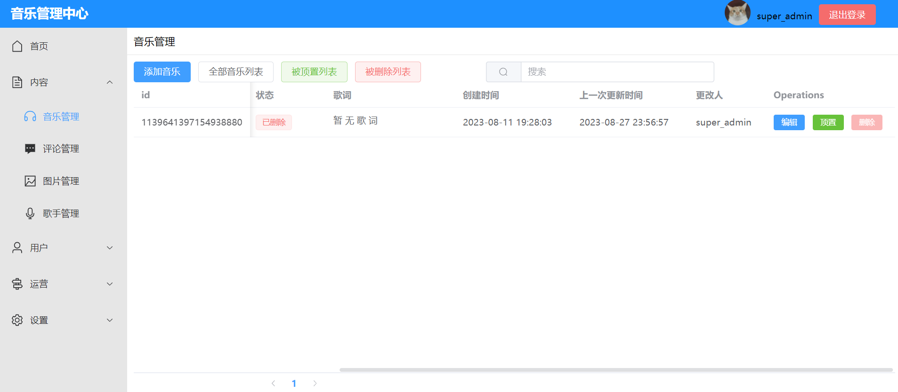
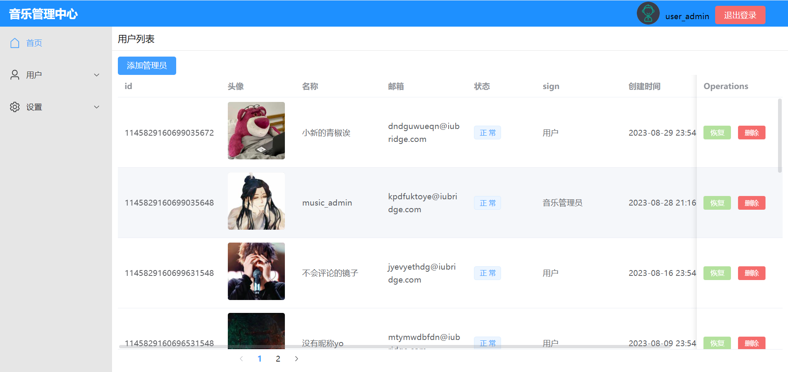

# 悦听音乐

本项目分为管理中心和悦听音乐APP。

### 管理中心：

技术栈：

后端：Spring Boot、Spring Security、MyBatis-Plus、docker、MySQL、Redis、Solr、Swagger、ik分词器等。

前端：Vue、Vue-router、Element-plus、echarts、axios等。

介绍：后台管理包括音乐管理、文件管理、社区管理等模块，管理员能审核内容，当被管理员删除的内容会被禁止再次提交，同时记录此操作的管理员信息，用户能通过URL访问资源。

实现：

​		1.在Linux中通过docker来使用mysql、redis、solr容器。使用solr+ik分词器来实现歌词歌名的自动分词搜索并将搜索结果高亮显示。

​		2.使用SpringSecurity+JWT实现登录统一认证，并鉴别权限显示不同的界面，以及通过Redis暂时保存登录的加密信息并配合MySQL实现双token机制优化用户体验。

​		3.上传的文件会先判断系统中是否存在或者是否被删除，存在或者已被管理员删除的文件不允许再次上传。

​		4.注册时Email发送及其他耗时请求将在使用时会暂时记录当前用户信息，且短时间内容不允许过多此操作。

#### 部分页面展示：

|                              |                                              |
| ------------------------------------------------------ | -------------------------------------------- |
| 以超级管理员为例（超级管理员能 看到/操作 到所有数据）  |                                              |
|                      |            |
|                      |  |
| 以用户管理员为例 （普通管理员只能 看到/操作 指定内容） |                                              |
|                |                                              |

### APP：

技术栈：MVP、StarrySky、lrcview、ARouter、Room、Glide、Retrofit、Okhttp、Rxjava、Rxlifecycle、BRVAH、自定义UI等。

介绍：通过组件化把APP分化成音乐、社区、登录、首页等模块，各模块能独立运行与测试。播放时在播放页可以手动切换歌词显示或音乐频谱显示。社区可以评论音乐，也可以评论评论。登录后APP可查看播放历史。

实现：

​		1.通过StarrySky来实现音乐操作，配合lrcview实现歌词展示，并能滑动歌词修改音乐播放节点。

​		2.通过ARouter来组件化项目，降低组件间耦合，组件间通信使用Parcelable来序列化要通信的数据。

​		3.在APP中修改音乐状态和信息时，手机通知栏中的播放状态和信息会同步更新，反之也行。

​		4.播放页时可以手动切换音乐频谱显示或歌词显示，在显示歌词时可以通过滑动歌词来更新音乐播放节点。

​		5.在首页有多种类型信息显示时，实现嵌套滑动，避免滑动冲突。

#### 部分页面展示：

|          |              |                                    |
| ------------------------------ | -------------------------------------------- | -------------------------------------------------------- |
|    |                  |  |
|    |  |                        |
|  |                |                                                          |

